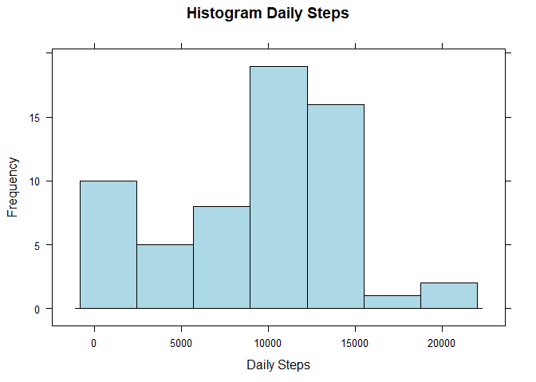
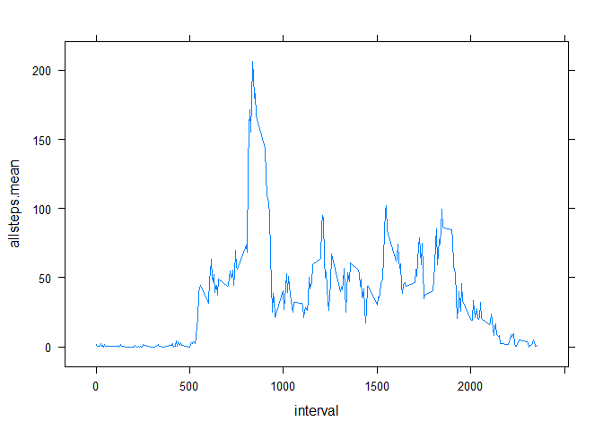
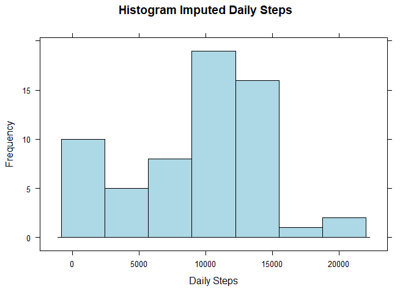
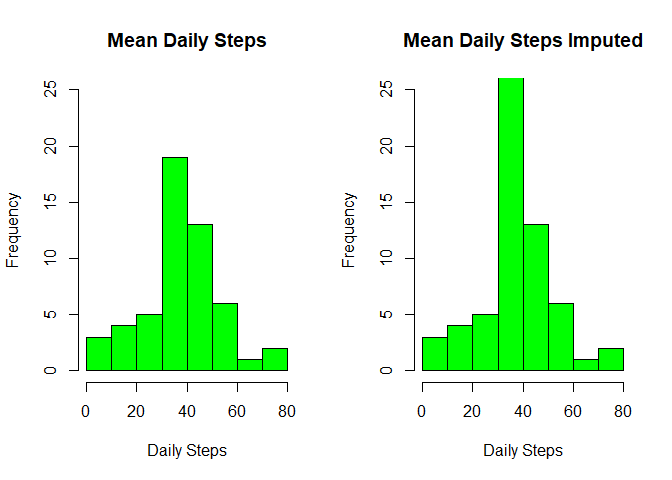
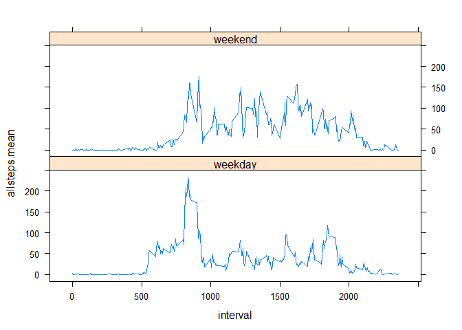

# Reproducible Research: Peer Assessment 1


## 1. Synopsis
This assignment makes use of data from a personal activity monitoring device. This device collects data at 5 minute intervals through out the day. The data consists of two months of data from an anonymous individual collected during the months of October and November, 2012 and include the number of steps taken in 5 minute intervals each day.

The data for this assignment can be downloaded from the course web site:
[Activity Monitoring Data](https://d396qusza40orc.cloudfront.net/repdata%2Fdata%2Factivity.zip)


## 2. Loading and preprocessing the data

```r
Actv <- read.csv("activity.csv")
Actv$date <- as.Date(Actv$date, format = "%Y-%m-%d")    #format the date variable
```


## 3. What is mean total number of steps taken per day?

### 3.1 Histogram of the total number of steps taken each day


```r
# Group by day and create new Summary table including number of steps per day, mean and median
Actv_Summary <- Actv %>% group_by(date) %>% 
  summarize(daily.steps = sum(steps, na.rm = TRUE), 
            daily.mean = mean(steps, na.rm = TRUE), 
            daily.median = median(steps, na.rm = TRUE))

# Show the histrogram for daily steps
histogram(Actv_Summary$daily.steps, xlab = "Daily Steps", ylab = "Frequency", type = "count", main = "Histogram Daily Steps", col = "light blue" , na.rm = TRUE)
```

<!-- -->


### 3.2 Mean and median total number of steps taken per day

```r
print(head(Actv_Summary[Actv_Summary$daily.mean != "NaN",], 15), type = "html")
```

```
## # A tibble: 15 x 4
##          date daily.steps daily.mean daily.median
##        <date>       <int>      <dbl>        <dbl>
##  1 2012-10-02         126    0.43750            0
##  2 2012-10-03       11352   39.41667            0
##  3 2012-10-04       12116   42.06944            0
##  4 2012-10-05       13294   46.15972            0
##  5 2012-10-06       15420   53.54167            0
##  6 2012-10-07       11015   38.24653            0
##  7 2012-10-09       12811   44.48264            0
##  8 2012-10-10        9900   34.37500            0
##  9 2012-10-11       10304   35.77778            0
## 10 2012-10-12       17382   60.35417            0
## 11 2012-10-13       12426   43.14583            0
## 12 2012-10-14       15098   52.42361            0
## 13 2012-10-15       10139   35.20486            0
## 14 2012-10-16       15084   52.37500            0
## 15 2012-10-17       13452   46.70833            0
```


## 4. What is the average daily activity pattern?

### 4.1 Time series plot of the 5-minute interval (x-axis) and the average number of steps taken, averaged across all days (y-axis)

```r
# Group and Summarize by intervals
Actv_Summary_int <- Actv %>% group_by(interval) %>% 
  summarize(allsteps = sum(steps, na.rm = TRUE), 
          allsteps.mean = mean(steps, na.rm = TRUE), 
          allsteps.median = median(steps, na.rm = TRUE))

# Plot with line type, x-axis is interval and y-axis All steps
xyplot(allsteps.mean ~ interval, Actv_Summary_int, type = "l")
```

<!-- -->

### 4.2 Maximum number of steps average across all the days in the dataset in 5-minutes interval

```r
maxsteps <- Actv_Summary_int[Actv_Summary_int$allsteps.mean == max(Actv_Summary_int$allsteps.mean),]
print(maxsteps)
```

```
## # A tibble: 1 x 4
##   interval allsteps allsteps.mean allsteps.median
##      <int>    <int>         <dbl>           <int>
## 1      835    10927      206.1698              19
```
Maximum number of steps average across all the days in the dataset in 5-minutes interval is **835 steps** 


## 5. Imputing missing values
### 5.1 Total number of missing values in the dataset

```r
steps_NA <- sum(is.na(Actv$steps)) # total number of NAs
print(steps_NA)
```

```
## [1] 2304
```

```r
steps_NA_Ratio <- mean(is.na(Actv$steps)) #ratio of NAs
print(steps_NA_Ratio)
```

```
## [1] 0.1311475
```

Total number of missing values in the dataset = **2304**
This represents a ratio of **13.1147541** % of the total observations.

### 5.2 Strategy for filling in all of the missing values in the dataset

The methodology used is calculating the mean steps of a certain 5-min interval across all days, and using this to imput the missing 5-min interval observation. 

### 5.3 Creating a new dataset that is equal to the original dataset but with the missing data filled in.


```r
# create a new table variable called steps.imput 
Actv$steps.imput <- Actv$steps
Actv <- Actv %>% group_by(interval) %>% mutate(interval.mean=mean(steps, na.rm=TRUE))
Actv[is.na(Actv$steps.imput),]$steps.imput <- Actv[is.na(Actv$steps.imput),]$interval.mean
# summarize by date (after imput)
Actv_Summary_impt <- Actv %>% group_by(date) %>% 
  summarize(daily.steps = sum(steps, na.rm = TRUE), 
            daily.steps.imput = sum(steps.imput),
            daily.mean.imput = mean(steps.imput), 
            daily.median.imput = median(steps.imput))
```


### 5.4 Histogram of the total number of steps taken each day

```r
histogram(Actv_Summary_impt$daily.steps, xlab = "Daily Steps", ylab = "Frequency", type = "count", main = "Histogram Imputed Daily Steps", col = "light blue" , na.rm = TRUE)
```

<!-- -->

### 5.5 Report of mean and median total number of steps taken per day. How these values differ from the estimates from the first part of the report? Impact of imputing missing data on the estimates of the total daily number of steps

```r
par(mfrow=c(1,2))
hist(Actv_Summary$daily.mean, xlab = "Daily Steps", main = "Mean Daily Steps", col = "green", ylim = c(0,25))
hist(Actv_Summary_impt$daily.mean.imput, xlab = "Daily Steps", main = "Mean Daily Steps Imputed", col = "green", ylim = c(0,25))
```

<!-- -->

The histogram comparison shows clearly the effect of imputing data. Around the mean the frequency has increased signifantly.
On the median instead of having Zero's in the original data, now the imputed median has some value.


Table of mean/median before and after imput

```r
Actv_Summary_all <- cbind(Actv_Summary, Actv_Summary_impt)
Actv_Summary_all <- Actv_Summary_all[,-c(2,5:7)]
head(Actv_Summary_all,10)
```

```
##          date daily.mean daily.median daily.mean.imput daily.median.imput
## 1  2012-10-01        NaN           NA         37.38260           34.11321
## 2  2012-10-02    0.43750            0          0.43750            0.00000
## 3  2012-10-03   39.41667            0         39.41667            0.00000
## 4  2012-10-04   42.06944            0         42.06944            0.00000
## 5  2012-10-05   46.15972            0         46.15972            0.00000
## 6  2012-10-06   53.54167            0         53.54167            0.00000
## 7  2012-10-07   38.24653            0         38.24653            0.00000
## 8  2012-10-08        NaN           NA         37.38260           34.11321
## 9  2012-10-09   44.48264            0         44.48264            0.00000
## 10 2012-10-10   34.37500            0         34.37500            0.00000
```

## 6. Are there differences in activity patterns between weekdays and weekends?


### 6.1 Creating a new factor variable with two levels **"weekday"** and **"weekend"**

```r
Actv$weekdays <- weekdays(Actv$date)
Actv$weekend <- Actv$weekdays == "Saturday" | Actv$weekdays == "Sunday"
# 4.1 Create a new factor variable in the dataset with two levels - "weekday" and "weekend" 
# indicating whether a given date is a weekday or weekend day
Actv <- mutate(Actv, weekendf = factor(ifelse(weekdays == "Saturday" | weekdays == "Sunday", "weekend", "weekday")))
```

### 6.2 Panel plot containing a time series plot of the 5-minute interval (x-axis) and the average number of steps taken, averaged across all weekday days or weekend days (y-axis). 


```r
# Group and Summarize by intervals
Actv_Summary_int_imp <- Actv %>% group_by(interval, weekendf) %>% 
  summarize(allsteps = sum(steps, na.rm = TRUE), 
          allsteps.mean = mean(steps, na.rm = TRUE), 
          allsteps.median = median(steps, na.rm = TRUE))

xyplot(allsteps.mean ~ interval|weekendf, Actv_Summary_int_imp, layout = c(1,2), type = "l")
```

<!-- -->


There is a difference in the activity between weekdays and weekends, the activity in weekdays starts earlier ~6am while in weekends it starts around 7am. 
As well during weekdays the activity slows down from 8pm while during weekends it extends till later.


--------- End of Report ------------
